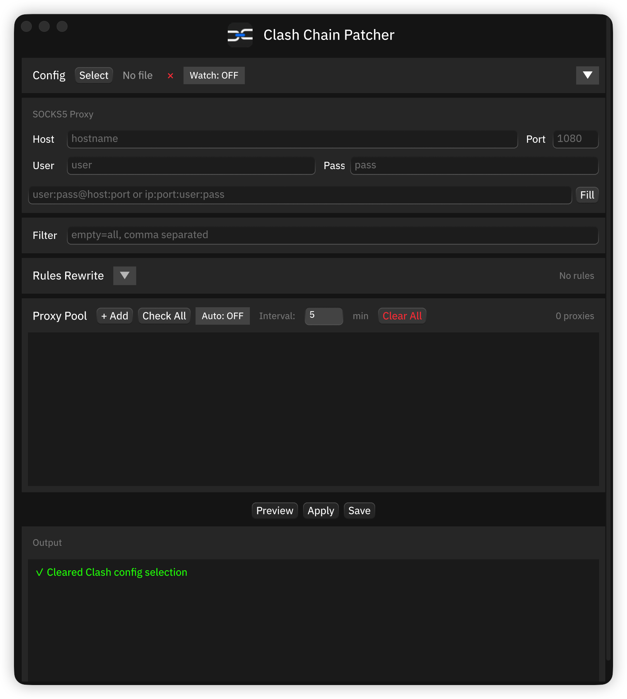

# Clash Chain Patcher 使用说明

<p align="center">
  
</p>

<p align="center">
  为 Clash 配置添加 SOCKS5 代理链的 GUI & CLI 工具
</p>

---

## 截图

<p align="center">
  
</p>

## 功能

- **双链式代理组** - 同时创建 Chain-Auto（自动选择最快）和 Chain-Selector（手动选择）
- **Rules 重写** - 选择性地将 Clash rules 重定向到链式代理（Chain-Selector / Chain-Auto）
- **代理池** - 管理多个 SOCKS5 上游代理，支持健康检测
- **文件监控** - 配置文件被外部修改时自动重新 Apply
- **CLI 支持** - 完整命令行工具 `ccp`，支持脚本自动化
- **跨平台** - Windows、macOS、Linux

## 工作原理

```
流量路径: 你 → Clash → VPN 节点 → 你的 SOCKS5 代理 → 互联网
```

## 下载

从 [Releases](../../releases) 下载最新版本：

| 平台 | 文件 | 说明 |
|------|------|------|
| Windows | `*-setup.exe` | 安装包（推荐） |
| Windows | `*-portable.zip` | 便携版 |
| macOS | `*.dmg` | 拖入 Applications |
| Linux | `clash-chain-patcher-linux` | `chmod +x` 后运行 |

### macOS 首次运行

```bash
xattr -cr /Applications/Clash\ Chain\ Patcher.app
```

---

## GUI 使用

### 第 1 步：添加 SOCKS5 代理

**方法 A：手动填写**
1. 填写 Host、Port、User、Pass
2. 点击 **+ Add**

**方法 B：快速填充**
1. 在输入框填写 `user:pass@host:port` 或 `host:port:user:pass`
2. 点击 **Fill** 自动填充表单
3. 点击 **+ Add**

### 第 2 步：选择 Clash 配置文件

点击 **Select** 选择你的 Clash YAML 配置文件。

加载后 Output 会显示检测到的 rules 信息。

### 第 3 步：Rules 重写（可选）

加载配置后，**Rules Rewrite** 面板会自动检测 rules 中引用的所有代理组：

```
Rules Rewrite  ▼                   3 groups, 630 rules
✓  Proxy            371 rules     [Chain-Selector]
·  DIRECT           233 rules     [Keep]
·  REJECT            26 rules     [Keep]
```

- 点击左侧 **✓/·** 启用/禁用该组的重写
- 点击右侧 **目标按钮** 循环切换：`Keep` → `Chain-Selector` → `Chain-Auto`
- 非 DIRECT/REJECT 的组默认勾选，目标为 Chain-Selector

### 第 4 步：Apply

点击 **Apply**，工具会：
1. 为每个代理节点创建 relay 链式代理
2. 创建 Chain-Selector 和 Chain-Auto 组
3. 按照勾选的设置重写 rules

### 第 5 步：在 Clash 中使用

1. 刷新 Clash 配置
2. 侧栏顶部会出现 **Chain-Selector** 和 **Chain-Auto**
3. 选择其中一个即可

### 其他功能

**文件监控**: 点击 **Watch: ON** 开启，配置被外部修改时自动重新 Apply。

**自动健康检测**: 点击 **Auto: OFF** 开启，定时检测代理池中代理的可用性。

---

## CLI 使用

CLI 工具名为 `ccp`（Clash Chain Patcher 缩写）。

### 查看配置信息

```bash
ccp info config.yaml
```

输出：
```
Rules: 3 groups, 630 total rules
Group                                       Rules
--------------------------------------------------
Proxy                                         371
DIRECT                                        233
REJECT                                         26

Proxy nodes: 45
Proxy groups: 5
```

### 完整应用：创建链式代理 + 重写 rules

```bash
# 自动检测主代理组，替换为 Chain-Selector
ccp apply config.yaml -p host:port:user:pass -r auto

# 指定替换目标
ccp apply config.yaml -p host:port -r "Proxy=Chain-Selector"

# 多个组同时替换
ccp apply config.yaml -p user:pass@host:port \
  -r "Proxy=Chain-Selector" \
  -r "Streaming=Chain-Auto"
```

### 仅重写 rules（不创建链式代理）

```bash
ccp rules config.yaml -r auto
ccp rules config.yaml -r "Proxy=Chain-Auto"
```

### 参数说明

```
ccp apply [OPTIONS] --proxy <PROXY> <CONFIG>

参数:
  -p, --proxy <PROXY>      SOCKS5 代理地址
  -r, --rewrite <REWRITE>  Rules 重写（可重复），或 "auto" 自动检测
      --no-backup          不创建备份
      --suffix <SUFFIX>    链式后缀 [默认: -Chain]
```

---

## 示例

原始配置：
```yaml
proxies:
  - name: "Tokyo-01"
    type: vmess
    server: example.com

proxy-groups:
  - name: "Proxy"
    type: select
    proxies: ["Tokyo-01"]

rules:
  - DOMAIN,google.com,Proxy
  - MATCH,Proxy
```

执行 `ccp apply config.yaml -p 1.2.3.4:1080 -r auto` 后：
```yaml
proxies:
  - name: "Local-Chain-Proxy"
    type: socks5
    server: 1.2.3.4
    port: 1080
  - name: "Tokyo-01"
    type: vmess
    server: example.com

proxy-groups:
  - name: "Chain-Selector"
    type: select
    proxies: ["Tokyo-01-Chain"]
  - name: "Chain-Auto"
    type: url-test
    proxies: ["Tokyo-01-Chain"]
  - name: "Proxy"
    type: select
    proxies: ["Chain-Selector", "Chain-Auto", "Tokyo-01"]
  - name: "Tokyo-01-Chain"
    type: relay
    proxies: ["Tokyo-01", "Local-Chain-Proxy"]

rules:
  - DOMAIN,google.com,Chain-Selector    # 原: Proxy
  - MATCH,Chain-Selector                # 原: Proxy
```

---

## 编译

```bash
git clone https://github.com/user/clash-chain-patcher.git
cd clash-chain-patcher

# GUI
cargo build --release --bin clash-chain-patcher

# CLI
cargo build --release --bin ccp
```

## 常见问题

**Q: Apply 后 Clash 没变化？**
A: 需要在 Clash 中刷新/重载配置。

**Q: Rules Rewrite 面板是空的？**
A: 先选择一个 Clash 配置文件，加载后会自动解析。

**Q: 如何只重写 rules 不创建 chain？**
A: 使用 CLI: `ccp rules config.yaml -r auto`

---

## 免责声明

本软件仅供**学习和研究**使用。用户需确保使用方式符合当地法律法规。

## 许可证

MIT License
