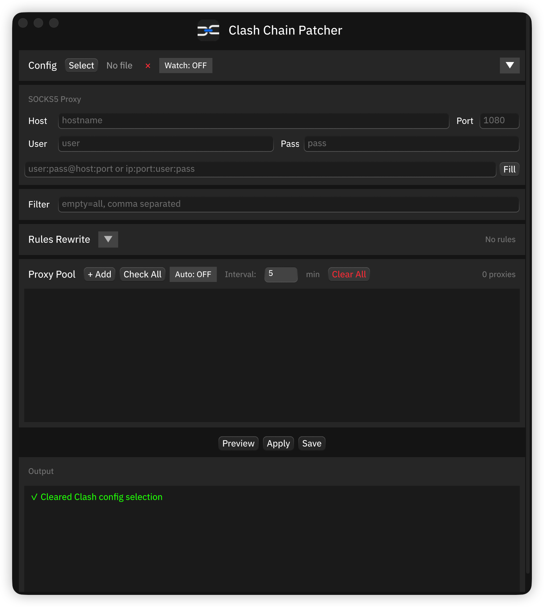

# Clash Chain Patcher

<p align="center">
  
</p>

<p align="center">
  A GUI tool to add SOCKS5 proxy chains to Clash configurations
</p>

<p align="center">
  <a href="#features">Features</a> •
  <a href="#download">Download</a> •
  <a href="#usage">Usage</a> •
  <a href="#building">Building</a> •
  <a href="README_CN.md">中文文档</a>
</p>

---

## Screenshot

<p align="center">
  
</p>

## Features

- **Add proxy chains** - Prepend a SOCKS5 proxy to existing Clash proxies
- **Filter proxies** - Select specific proxies by keywords
- **Two input formats** - Support `user:pass@host:port` and `ip:port:user:pass`
- **Preview changes** - See what will be modified before applying
- **Cross-platform** - Windows, macOS, Linux

## Download

Download the latest release from [Releases](../../releases):

| Platform | File | Note |
|----------|------|------|
| Windows | `*-setup.exe` | NSIS Installer (Recommended) |
| Windows | `*-portable.zip` | Portable version (unzip and run) |
| macOS | `Clash-Chain-Patcher-macos.dmg` | Drag to Applications |
| macOS | `Clash-Chain-Patcher-macos.zip` | Contains .app bundle |
| Linux | `clash-chain-patcher-linux` | Make executable with `chmod +x` |

### macOS: First Launch

Since the app is not signed with an Apple Developer certificate, macOS Gatekeeper will block it (shows "damaged").

**Solution: Run in Terminal**
```bash
# If app is in Downloads folder
xattr -cr ~/Downloads/Clash\ Chain\ Patcher.app

# If moved to Applications
xattr -cr /Applications/Clash\ Chain\ Patcher.app
```

Then you can double-click to open normally.

### Linux: First Launch
```bash
chmod +x clash-chain-patcher-linux
./clash-chain-patcher-linux
```

## Usage

### 1. Select Config File
Click **Select** to choose your Clash YAML configuration file.

### 2. Enter SOCKS5 Proxy
Fill in the proxy details:
- **Host**: Proxy server hostname or IP
- **Port**: Proxy port (e.g., 1080)
- **User/Pass**: Authentication credentials (optional)

Or paste a proxy string and click **Fill**:
```
user:pass@host:port
# or
ip:port:user:pass
```

### 3. Filter (Optional)
Enter keywords separated by commas to only patch matching proxies.
Leave empty to patch all proxies.

### 4. Preview & Apply
- **Preview** - See which proxy chains will be created
- **Apply** - Generate the patched configuration
- **Save** - Save the result to a new file

## How It Works

The tool creates "relay" proxy chains by:

1. Reading your Clash config
2. Creating a SOCKS5 proxy entry for your proxy server
3. For each original proxy, creating a new "relay" type proxy that chains through your SOCKS5

Example:
```yaml
# Original proxy
- name: "Tokyo-01"
  type: vmess
  server: example.com
  ...

# Generated chain
- name: "Tokyo-01-chain"
  type: relay
  proxies:
    - "SOCKS5-Proxy"
    - "Tokyo-01"
```

## Building

### Prerequisites
- Rust 1.70+
- Python 3.8+ (for icon generation)

### Build from source

```bash
# Clone
git clone https://github.com/user/clash-chain-patcher.git
cd clash-chain-patcher

# Generate icons (optional, for custom logo)
pip install pillow
python scripts/generate_icons.py

# Build
cargo build --release

# macOS: Create .app bundle
./scripts/bundle_macos.sh
```

### Build outputs
- **Windows**: `target/release/clash-chain-patcher.exe` (icon embedded)
- **macOS**: `target/bundle/Clash Chain Patcher.app`
- **Linux**: `target/release/clash-chain-patcher`

## Development

### Project Structure
```
clash-chain-patcher-rust/
├── src/
│   ├── main.rs          # Entry point
│   ├── app.rs           # GUI application
│   └── patcher.rs       # Core patching logic
├── logo/
│   ├── clash-chain-patcher.png  # Source logo
│   ├── AppIcon.icns     # macOS icon
│   └── app.ico          # Windows icon
├── scripts/
│   ├── generate_icons.py    # Icon converter
│   └── bundle_macos.sh      # macOS bundler
└── .github/workflows/
    └── release.yml      # CI/CD
```

### Tech Stack
- **GUI**: [Makepad](https://github.com/makepad/makepad) - Rust UI framework
- **YAML**: serde_yaml
- **File dialogs**: rfd

## Known Issues

### Windows: "Makepad" Title Bar

On Windows, there is a known Makepad framework bug where the native window title bar displays "Makepad" instead of the application name. This is a cosmetic issue only and does not affect functionality.

<p align="center">
  
</p>

## Disclaimer

This software is provided for **educational and research purposes only**.

- This tool is intended solely for learning network technologies and personal research
- Users are responsible for ensuring their use complies with all applicable local laws and regulations
- The author assumes no liability for any misuse, damage, or legal consequences arising from the use of this software
- By using this software, you agree that you understand and accept these terms

**Use at your own risk.**

## License

MIT License

## Contributing

Issues and Pull Requests are welcome!
